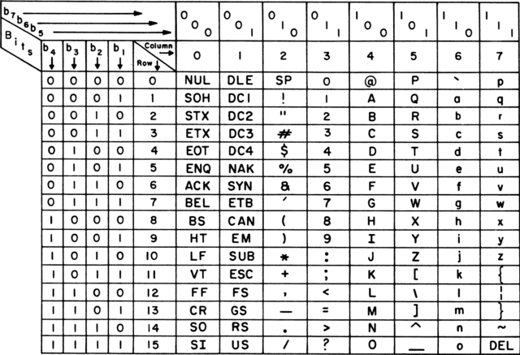

# Hasher

A tool for calculating and checking hash sums of files.

## Supported Hash Sums

At the moment this tool supports following hash sum algorithms:
* CRC-32
* MD-5
* SHA-256

## Usage
`hasher.exe [Action] [HashType] [ObjectType] [ObjectPath]`

### Examples
`hasher.exe Calculate CRC32 Folder "Images\Cats"`  
`hasher.exe Check MD5 File MD5sums.txt`  

### Notes
Possible actions: Calculate, Check.  
Possible hash types: CRC32, MD5, SHA256.  
Possible object types: File, Folder or Directory.  
If action name is omitted, the default one is used.  
Default action is calculation.  
Hash sum checking is available for a sum file only.  
Letter case is not important.  
Change directory (CD) to a working directory before usage.  

## Building

Use the `build.bat` script included with the source code.

## Installation
`go install github.com/vault-thirteen/Hasher/cmd/hasher@latest`

## Why ?

Even at this moment hash tools for Windows operating system are very poor. 
The set of utilities which comes with Git for Windows contains hash tools for 
MD5 and SHA256, but support for good old CRC32 is absent. Moreover, there are 
some bugs in the tools included with GNU Core Utilities embedded into Git for 
Windows. 

## Additional Notes

Calculator writes lines with standard line end (CR+LF).  
Checker reads lines with standard line end (CR+LF).  
If you do not agree with it, you should read the following article:  
https://en.wikipedia.org/wiki/Newline

Note that Go language is sly when it comes to reading text lines.
It provides methods to write OS-specific text, but it does not provide any 
tools to read OS-specific text lines. Instead, Go languages gives freedom of 
choice.

Imagine, how would you parse text which has new lines. Would you read it until 
the LF (Line Feed) character as Unix does ? Or would you read it until the CR 
(Carriage Return) symbol as Macintosh does ? What would you do if you 
occasionally met a combination of them ? Would you see them as two lines, one 
of which is empty, or should they be concatenated ? Too many questions arise 
since the good old standard was broken by some sly "inventors" and "optimizers".

Historically Carriage Return means the return of carriage. That is it.

Historically Line Feed means movement of the carriage to the next line down the text. 
That is it.

Further "inventions" in this field only lead to anarchy.

If you want to "invent" a new 'New Line' symbol, create a new standalone 
Unicode symbol, do not break the history of the humankind, the ASCII standard.

### ASCII
ASCII Code Chart, 1967.

